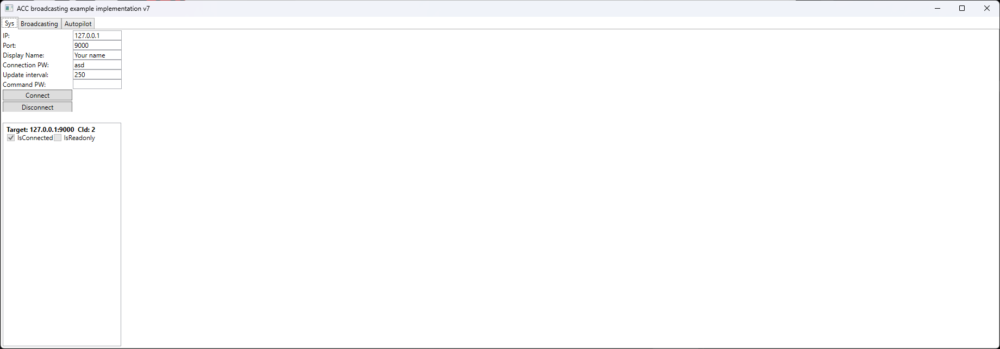
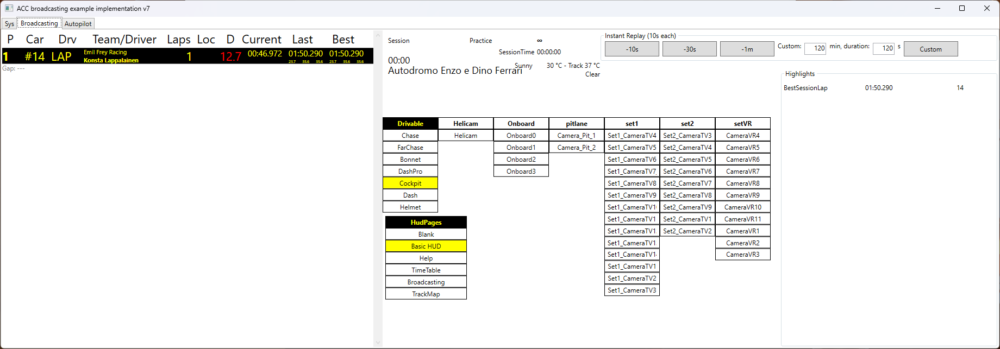
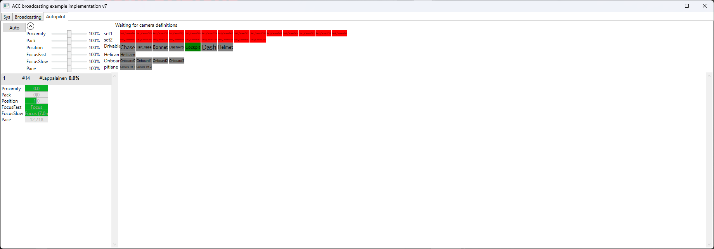

.Net code describing the messages can be found in the ACC Steam installation:
```
.../SteamLibrary/steamapps/common/Assetto Corsa Competizione Dedicated Server/sdk/broadcasting/Sources
```
If you download the Assetto Corsa Competizione Dedicated Server on Steam, you can find `ServerAdminHandbook.pdf` under the server directory with the info.

I've moved my steam libary to `d:` so on my system it is here:
```
D:\SteamLibrary\steamapps\common\Assetto Corsa Competizione Dedicated Server\server\ServerAdminHandbook.pdf
```

In `C:\Users\paulr\Documents\Assetto Corsa Competizione\Config\broadcasting.json` you can find the broadcasting configuration - you'll need the port and connection password from here:
```json
{                                                                                                                         
  "updListenerPort": 9000,
  "connectionPassword": "asd",
  "commandPassword": ""
}
```

In `D:\SteamLibrary\steamapps\common\Assetto Corsa Competizione Dedicated Server\sdk\broadcasting\Testclient\src\readme.txt` we can see the instructions for testing the broadcasting feature:
```text
To test the broadcasting functionality, please start ACC v1.0 once, and edit your Documents\config\broadcasting.json to

{
  "updListenerPort": 9000,
  "connectionPassword": "asd",
  "commandPassword": ""
}

Then you can simply launch a SP or MP session, and click "connecte" in the first tab. The default values should allow you to immediately connect.
```

Then, while ACC is running run open the test client found in `D:\SteamLibrary\steamapps\common\Assetto Corsa Competizione Dedicated Server\sdk\broadcasting\Testclient\`

You should be able to click the connect button and see data as you drive:





